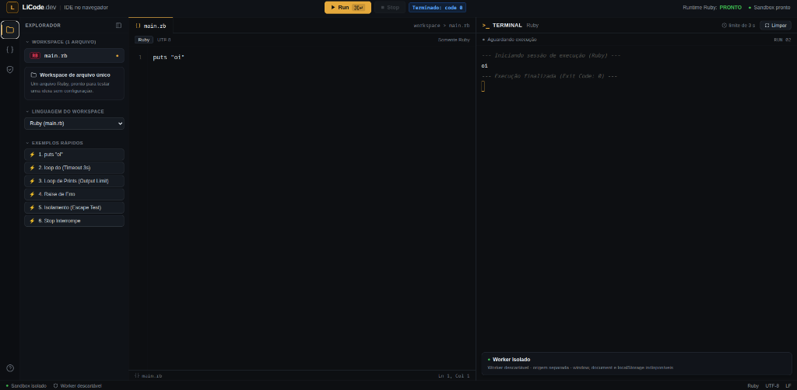

# LiCode.dev — IDE no navegador

O LiCode executa código no navegador usando Web Workers e WebAssembly, sem servidor de execução backend.



## Acesso em Produção

A aplicação está disponível e operando com duas origens separadas por razões de segurança:
- **Interface Web**: [https://licode-web.vercel.app](https://licode-web.vercel.app)
- **Sandbox de Execução**: [https://licode-sandbox.vercel.app](https://licode-sandbox.vercel.app)

---

## Executar localmente

Pré-requisitos: Node.js 20 ou superior e pnpm 12.

```bash
pnpm install
pnpm dev
```

Abra [http://localhost:5173](http://localhost:5173). O comando inicia a aplicação web na porta 5173 e o host isolado de execução na porta 5174.

## Build e verificações

```bash
pnpm build
pnpm typecheck
pnpm test
```

## Estrutura

- `apps/web`: interface SvelteKit, editor, terminal xterm.js e integração com os runtimes.
- `apps/sandbox`: host isolado por origem que inicia workers efêmeros para executar código.
- `packages/protocol`: tipos das mensagens entre interface, sandbox e workers.
- `packages/runtime-core`: interfaces e registro de runtimes.
- `packages/runtime-*`: runtimes de JavaScript, Python e Ruby.

## Linguagens Suportadas

- **JavaScript**: engine nativa do navegador, em Web Worker isolado.
- **TypeScript**: transpilado e executado em worker dedicado.
- **Python**: CPython 3.12 via Pyodide/WebAssembly com suporte a cache local.
- **Ruby**: CRuby 3.4 via `ruby.wasm` com suporte a stdlib e cache local.
- **C / C++**: *Em desenvolvimento / experimental (não disponível/não funcional nesta versão de produção)*.

## Segurança e limites

O código roda em uma origem separada da interface, em workers descartáveis. Um watchdog externo ao worker interrompe programas que excedem o limite de execução; a saída também tem limite para evitar travar a aba. Entrada interativa por stdin ainda não é suportada.

## Deploy em Produção (Vercel / Cloudflare Pages)

O LiCode opera com duas origens separadas por razões de segurança e isolamento de execução:
1. **Interface Web (`licode-web`)**: [https://licode-web.vercel.app](https://licode-web.vercel.app)
2. **Sandbox Isolado (`licode-sandbox`)**: [https://licode-sandbox.vercel.app](https://licode-sandbox.vercel.app)

### Variáveis de Build (Build-Time)
- **Web (`apps/web`)**: `PUBLIC_SANDBOX_URL` aponta para a URL do sandbox (`https://licode-sandbox.vercel.app`).
- **Sandbox (`apps/sandbox`)**: `VITE_ALLOWED_PARENT_ORIGINS` define a lista de origens pai autorizadas (`https://licode-web.vercel.app`). Em produção, se omitida, o sandbox opera em falha fechada (rejeita handshakes).

### Headers de Segurança e Isolamento
- **Web** (`apps/web/static/_headers` e `apps/web/static/vercel.json`):
  - `Cross-Origin-Opener-Policy: same-origin`
  - `Cross-Origin-Embedder-Policy: require-corp`
  - `X-Content-Type-Options: nosniff`
  - `Referrer-Policy: strict-origin-when-cross-origin`
- **Sandbox** (`apps/sandbox/public/_headers` e `apps/sandbox/public/vercel.json`):
  - `Content-Security-Policy: frame-ancestors https://licode-web.vercel.app` (bloqueia qualquer tentativa de embed por terceiros)
  - `Cross-Origin-Opener-Policy: same-origin`
  - `Cross-Origin-Embedder-Policy: require-corp`
  - `Cross-Origin-Resource-Policy: cross-origin`
  - `X-Content-Type-Options: nosniff`
  - `Referrer-Policy: no-referrer`
  - `Cache-Control: public, max-age=31536000, immutable` para `/assets/*` versionados (WASM do Pyodide e Ruby).

### Comandos de Deploy (Vercel CLI)
```bash
# 1. Build do Sandbox
VITE_ALLOWED_PARENT_ORIGINS="https://licode-web.vercel.app" pnpm --filter @licode/sandbox build

# 2. Deploy do Sandbox na Vercel
vercel deploy apps/sandbox/dist --prod --yes --name licode-sandbox

# 3. Build da Aplicação Web
PUBLIC_SANDBOX_URL="https://licode-sandbox.vercel.app" pnpm --filter @licode/web build

# 4. Deploy da Web na Vercel
vercel deploy apps/web/build --prod --yes --name licode-web
```

> **Nota:** Para Cloudflare Pages, a estrutura de pastas e os arquivos `_headers` gerados nas pastas de saída são 100% compatíveis, utilizando `wrangler pages deploy apps/sandbox/dist --project-name=licode-sandbox` e `wrangler pages deploy apps/web/build --project-name=licode-web`.
